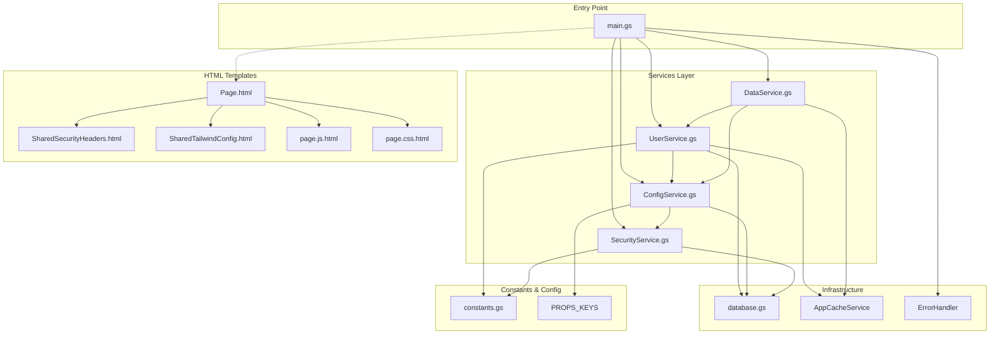

# 依存関係マップ - Dependency Map

> **🎯 目的**: デプロイエラーを事前に防ぐための完全な依存関係可視化

## 🏗️ アーキテクチャ概要



## 🔍 詳細依存関係

### 🎯 main.gs
**必須依存:**
- `UserService` (services/UserService.gs)
- `ConfigService` (services/ConfigService.gs)
- `DataService` (services/DataService.gs)
- `SecurityService` (services/SecurityService.gs)
- `ErrorHandler` (utils/CacheManager.gs)
- `PROPS_KEYS` (core/constants.gs)
- `include()` 関数 (main.gs内で定義)

**重要な関数:**
- `doGet(e)` - HTTPエントリーポイント
- `doPost(e)` - POST処理エントリーポイント
- `include(filename)` - HTMLテンプレート読み込み

### ⚙️ Services層

#### 👤 UserService.gs
**必須依存:**
- `AppCacheService` (utils/CacheManager.gs)
- `DB` (database.gs)
- `CONSTANTS.ACCESS.LEVELS` (core/constants.gs)
- `ConfigService` (間接的)

**提供機能:**
- `getCurrentEmail()` - セッション管理
- `getCurrentUserInfo()` - ユーザー情報取得
- `isSystemAdmin(email)` - 管理者権限確認

#### 🔧 ConfigService.gs
**必須依存:**
- `DB` (database.gs)
- `PROPS_KEYS` (core/constants.gs)
- `SecurityService` (間接的)

**提供機能:**
- `getUserConfig(userId)` - 設定取得
- `hasCoreSystemProps()` - システム設定確認
- `isSystemSetup()` - セットアップ状態確認

#### 📊 DataService.gs
**必須依存:**
- `UserService` (services/UserService.gs)
- `ConfigService` (services/ConfigService.gs)
- `AppCacheService` (utils/CacheManager.gs)

**提供機能:**
- `getBulkData(userId, options)` - 一括データ取得
- `getSheetData(userId, options)` - シートデータ取得
- `isSystemSetup()` - データレベルセットアップ確認

#### 🛡️ SecurityService.gs
**必須依存:**
- `CONSTANTS.ACCESS.LEVELS` (core/constants.gs)
- `DB` (database.gs)

**提供機能:**
- `checkUserPermission(userId, permission)` - 権限確認
- `diagnose()` - セキュリティ状態診断

### 🏗️ Infrastructure層

#### 🗄️ database.gs
**依存なし** (基盤レイヤー)
**提供機能:**
- `findUserByEmail(email)`
- `findUserById(userId)`
- `getAllUsers()`
- `createUser(userData)`

#### 💾 AppCacheService (utils/CacheManager.gs)
**必須依存:**
- `CacheService` (GAS標準)

**提供機能:**
- `get(key)`, `set(key, value, ttl)`, `remove(key)`
- `TTL.SHORT/MEDIUM/LONG` 定数

#### 🚨 ErrorHandler (utils/CacheManager.gs)
**依存なし**
**提供機能:**
- `handle(error, context)` - 統一エラー処理
- `generateErrorCode(error)` - エラーコード生成

### 📋 Constants

#### core/constants.gs
**依存なし** (基盤レイヤー)
**提供定数:**
- `CONSTANTS.ACCESS.LEVELS.*` - アクセスレベル定義
- `PROPS_KEYS.*` - プロパティキー定義

### 🌐 HTML Templates

#### Page.html
**必須include:**
- `SharedSecurityHeaders` (SharedSecurityHeaders.html)
- `SharedTailwindConfig` (SharedTailwindConfig.html)
- `page.css` (page.css.html)
- `page.js` (page.js.html)

**include関数依存:**
- `include()` 関数がmain.gsで定義されている必要あり

## 🚨 クリティカルパス

### 💥 デプロイが失敗する条件

1. **include関数未定義**
   ```
   Page.html → include('SharedSecurityHeaders')
   ↓
   main.gs に include() 関数が存在しない → ERROR
   ```

2. **Services層の循環依存**
   ```
   UserService → ConfigService → SecurityService → UserService
   ↓
   初期化順序エラー → ERROR
   ```

3. **定数未定義**
   ```
   UserService → CONSTANTS.ACCESS.LEVELS
   ↓
   core/constants.gs が存在しない → ERROR
   ```

4. **キャッシュサービス未定義**
   ```
   UserService → AppCacheService.get()
   ↓
   CacheManager.gs が存在しない → ERROR
   ```

## ✅ デプロイ前チェックリスト

### 🔍 必須ファイル存在確認
- [ ] `src/main.gs` (include関数含む)
- [ ] `src/core/constants.gs`
- [ ] `src/database.gs`
- [ ] `src/utils/CacheManager.gs`
- [ ] `src/services/UserService.gs`
- [ ] `src/services/ConfigService.gs`
- [ ] `src/services/DataService.gs`
- [ ] `src/services/SecurityService.gs`

### 🔗 依存関係整合性確認
- [ ] 全Services層がAppCacheServiceを参照可能
- [ ] 全Services層がCONSTANTS定数を参照可能
- [ ] HTMLテンプレートのincludeファイルが全て存在
- [ ] main.gsにinclude関数が定義済み

### 🧪 基本動作テスト
- [ ] `clasp run include` でエラーなし
- [ ] `clasp run getCurrentUserEmail` でエラーなし
- [ ] デプロイ後にWebアプリアクセスでエラーなし

## 🔄 推奨デプロイ順序

1. **基盤ファイル**
   - `core/constants.gs`
   - `database.gs`
   - `utils/CacheManager.gs`

2. **Services層**（依存関係順）
   - `services/SecurityService.gs`
   - `services/ConfigService.gs`
   - `services/UserService.gs`
   - `services/DataService.gs`

3. **エントリーポイント**
   - `main.gs`

4. **テンプレート**
   - HTML files

## 🛠️ 使用方法

```bash
# 事前検証
node scripts/pre-deploy-check.js

# 安全デプロイ
./scripts/safe-deploy.sh

# 手動確認の場合
clasp push --force  # ⚠️ 非推奨
```