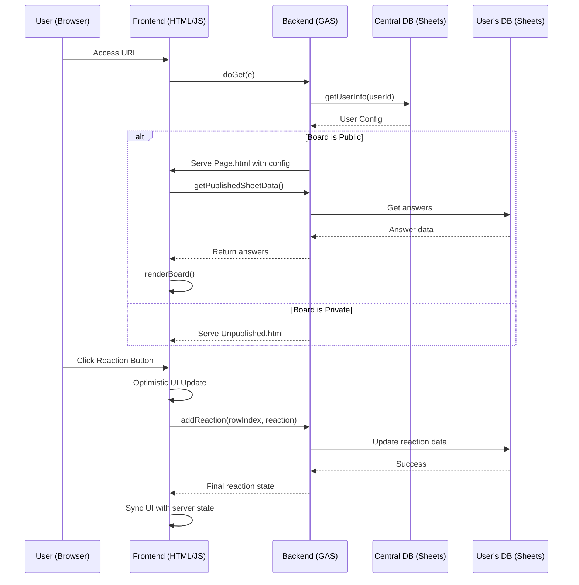

# **StudyQuest：みんなの回答ボード**

## 0\. ドキュメント管理

### 0.1. 本ドキュメントの目的

本ドキュメントは、Google Workspaceプラットフォーム上で動作するWebアプリケーション「みんなの回答ボード」の機能、仕様、および非機能要件を網羅的に定義するものです。開発、品質保証、運用保守に関わる全てのステークホルダーが、本システムの全体像と詳細を正確に理解し、共通認識を持つことを目的とします。

### 0.2. 改訂履歴

| 版 | 日付 | 改訂者 | 概要 |
| :--- | :--- | :--- | :--- |
| 1.0 | 2025/07/04 | Gemini | 初期バージョンの作成 |
| 2.0 | 2025/07/05 | Gemini | 機能要件の拡充、非機能要件の追加、画面フローの明記 |
| 3.0 | 2025/07/05 | Gemini | 開発者向けに、ユーザー体験向上と運用保守性強化のための要件を追加 |
| 4.0 | 2025/07/05 | Gemini | 機能のシンプル化と、各要件の超詳細化を実施。 |
| 5.0 | 2025/07/14 | Gemini | マルチテナント化と自動テスト環境(Jest)の導入。 |

### 0.3. 用語集

| 用語 | 説明 |
| :--- | :--- |
| **GAS** | Google Apps Script。本システムのサーバーサイドロジックを実行する環境。 |
| **サービスアカウント** | Google Cloud Platformで作成される非人間アカウント。サーバー間連携でAPIを安全に利用するために使用する。 |
| **中央データベース** | 全ユーザーの基本情報と設定を管理する、システム専用のGoogleスプレッドシート。 |
| **回答データシート** | 各ユーザー（教師）が所有し、生徒の回答が記録されるGoogleスプレッドシート。 |
| **ボード** | 回答データシートの内容をWebページ上にカード形式で表示したもの。 |
| **管理者** | 教師ユーザー。自身のボードを作成・管理する権限を持つ。 |
| **システム管理者** | 本システム全体をセットアップし、管理する最上位の権限者。 |
| **楽観的UI** | ユーザーのアクションに対し、サーバーの応答を待たずに即座にUIを更新する手法。体感速度を向上させる。 |
| **ポーリング** | クライアントが一定間隔でサーバーに更新がないか問い合わせる通信方式。 |
| **コンフィグ** | 各ボード（シート）ごとの列マッピングや表示設定などの構成情報。 |
| **TTI** | Time to Interactive。ユーザーがページを操作可能になるまでの時間。 |
| **WCAG** | Web Content Accessibility Guidelines。ウェブアクセシビリティのガイドライン。 |
| **JSDoc** | JavaScriptコードに注釈をつけるためのマークアップ言語。 |

-----

## 1\. システム概要

### 1.1. プロジェクトの目的と背景

本プロジェクトは、教育現場における双方向学習を促進するツールを提供することを目的とします。従来のシステムが抱えていたGoogle Workspaceの権限設定の複雑さや、それに起因する403エラー問題を、**サービスアカウントモデル**へ移行することで根本的に解決します。これにより、導入のハードルを下げ、より多くの教育者が安全かつ手軽に利用できる環境を構築します。

本バージョンでは、コアとなる機能に絞り込み、その上で各機能の品質、安定性、そしてユーザー体験を極限まで高めることを目指します。

### 1.2. システムのスコープ

#### 1.2.1. スコープ内

  * ユーザーアカウントの作成と管理
  * Googleフォームおよびスプレッドシートを用いた回答データストアの自動生成
  * 既存スプレッドシートのボードとしての利用
  * 回答データのカード形式でのリアルタイム表示
  * 回答に対する3種類のリアクション機能
  * 教師による回答のハイライト機能
  * ボードの公開・非公開設定
  * 回答表示列のカスタマイズ（マッピング）機能
  * 基本的な表示オプション（記名/匿名、リアクション数表示/非表示）

#### 1.2.2. スコープ外

  * 回答データのCSV/PDFエクスポート機能
  * ダッシュボードや統計レポート機能
  * 回答へのコメント（返信）機能
  * リッチテキスト、画像、ファイルの添付機能
  * リアルタイム共同編集機能（複数人による同時編集）

### 1.3. ユーザープロファイルとユースケース

#### 1.3.1. 教師ユーザー（管理者）

  * **ペルソナ**: ITツールに必ずしも精通していないが、授業をよりインタラクティブにしたいと考えている学校の教師。
  * **主なユースケース**:
      * 授業の冒頭で、新しい回答ボードをワンクリックで作成し、生成されたGoogleフォームのURLを生徒に共有する。
      * 授業中、生徒から投稿された回答をリアルタイムで確認し、議論のきっかけとなる興味深い回答をハイライトする。
      * 授業のテーマに合わせて、複数のボード（シート）を切り替えて表示する。
      * 生徒の心理的安全性を確保するため、一時的に匿名モードに切り替える。
      * 授業終了後、ボードを非公開にする。

#### 1.3.2. 生徒ユーザー（閲覧者）

  * **ペルソナ**: GIGAスクール構想で配布されたタブレットやPCを使用する小中高生。
  * **主なユースケース**:
      * 教師から共有されたフォームに、自分の意見や回答を入力して送信する。
      * 共有されたボードのURLにアクセスし、クラスメイトの多様な意見を閲覧する。
      * ボードURLは管理者と同じGoogle Workspaceドメインのユーザーのみ利用できる。
      * 共感したり、参考になったりした意見にリアクションを送る。
      * 教師がハイライトした意見に注目し、議論のポイントを理解する。
      * 他の人の意見を見て、自分の考えを深めたり、新たな視点を得たりする。

-----

## 2\. システムアーキテクチャ

### 2.1. 全体構成

本システムは、Google Workspaceのサービス群を最大限に活用したサーバーレスアーキテクチャを採用します。

  * **バックエンド**: **Google Apps Script (GAS)** を利用し、V8ランタイムで動作します。
  * **フロントエンド**: **HTML/CSS/JavaScript** で構築し、スタイリングにはTailwind CSSのCDNを利用します。
  * **データベース**: **Google Sheets** を主要なデータストアとして使用します。
  * **認証**: Googleアカウント認証と、APIアクセスのための**サービスアカウントモデル**を採用します。
  * **マルチテナント構成**: 管理者ごとに専用のシートとフォームを生成し、データを隔離します。

### 2.2. データフロー

### 2.3. 追加アーキテクチャ要素

  * **Event-Driven Registration**: `AdvancedArchitecture.gs` 内の `UserRegistrationEvent` クラスでユーザー登録イベントを管理。
  * **Circuit Breaker & Bulkhead**: 同ファイルの `CircuitBreaker` と `ResourcePool` により高負荷時の安定性を確保。
  * **Predictive Cache**: `PredictiveCache` がアクセスパターンを学習し、関連データを先読みします。

-----

## 3\. 機能要件

### 3.1. ユーザー管理機能 (USR)

| ID | 機能名 | 詳細仕様 |
| :--- | :--- | :--- |
| **USR-001** | 新規ユーザー登録 | `registerNewUser()` は、Google Drive内にユーザー専用フォルダを作成し、その中に回答データ用スプレッドシートと連携するGoogleフォームを生成する。生成されたIDは中央DBに記録される。 |
| **USR-002** | ユーザー認証 | `doGet(e)` は、リクエストごとに `Session.getActiveUser().getEmail()` を用いてユーザーを識別し、認証されていない場合はGoogleのログインページへリダイレクトさせる。 |

### 3.2. 回答ボード機能 (BRD)

| ID | 機能名 | 詳細仕様 |
| :--- | :--- | :--- |
| **BRD-001** | 回答一覧表示 | `Page.html` 内の `StudyQuestApp.renderBoard()` が、取得した回答データを基にDOM要素を生成・描画する。 |
| **BRD-002** | 回答の並び替え | UIのドロップダウンで「新着順」「ランダム」を選択可能。選択された値は `getPublishedSheetData()` の引数として渡され、サーバーサイドで `Array.prototype.sort()` や `Math.random()` を用いてソート処理が行われる。 |
| **BRD-003** | リアクション機能 | `addReaction()` は、対象セルの値（メールアドレス一覧）を読み取り、指定されたユーザーのメールアドレスを追加または削除した後、セルに書き戻す。処理は `LockService` を用いて排他制御される。 |
| **BRD-004** | ハイライト表示 | `toggleHighlight()` は、対象行の「ハイライト」列の値を `TRUE` / `FALSE` で切り替える。この操作は管理者権限を持つユーザーのみ実行可能。 |
| **BRD-005** | 新着通知 | `checkForNewContent()` は、対象シートの最終行を取得し、クライアントが保持する回答数と比較する。差分があった場合のみ新着ありと判断する。 |

### 3.3. 管理者機能 (ADM)

| ID | 機能名 | 詳細仕様 |
| :--- | :--- | :--- |
| **ADM-001** | 新規ボード作成 | `createBoardFromAdmin()` は、`SpreadsheetApp.create()` と `FormApp.create()` を用いて新しいファイルを作成し、`DriveApp` を使ってユーザーの専用フォルダに移動させる。 |
| **ADM-002** | 既存シート利用 | `addSpreadsheetUrl()` は、入力されたURLからスプレッドシートIDを抽出し、そのIDとシート名を中央DBの `configJson` に追記する。 |
| **ADM-003** | 公開シート切り替え | `switchToSheet(sheetName)` は、中央DBの `configJson` 内の `publishedSheet` プロパティを更新し、`appPublished` フラグを `true` に設定する。 |
| **ADM-004** | 表示モード設定 | `saveDisplayOptions()` は、中央DBの `configJson` 内の `displayMode` (`anonymous`/`named`) と `showCounts` (`true`/`false`) の値を更新する。 |
| **ADM-005** | 列マッピング設定 | `saveSheetConfig()` は、引数で受け取った設定オブジェクトを、`configJson` 内の該当シート名のキーに対応する値として保存する。 |

-----

## 4\. 画面仕様とフロントエンドフロー

### 4.1. 画面一覧

  * **`SetupPage.html`**: 初回システムセットアップ画面。
  * **`Registration.html`**: 新規ユーザー登録画面。
  * **`AdminPanel.html`**: 教師向けの管理画面。
  * **`Page.html`**: 生徒や一般閲覧者向けのメインの回答ボード画面。
  * **`SharedModals.html`**: プライバシーやデジタル・シティズンシップなど、共通モーダルをまとめたテンプレート。

### 4.2. 詳細フロントエンドフロー

  * **フロー1: 初回システムセットアップ (`SetupPage.html`)**

    1.  **サーバー**: `doGet(e)` は `PropertiesService` にシステム設定がないことを確認し、`SetupPage.html` を返す。
    2.  **クライアント**: 管理者が情報を入力し、`google.script.run.setupApplication()` を実行。

  * **フロー2: 新規ユーザー登録 (`Registration.html`)**

    1.  **サーバー**: `doGet(e)` はユーザーが中央DBに未登録と判断し、`Registration.html` を返す。
    2.  **クライアント**: `google.script.run.getExistingBoard()` を実行し未登録を確認後、`registerNewUser()` を実行。
    3.  **キャッシュ**: `getExistingBoard` はサーバーサイドでユーザー情報をキャッシュし、DBへの不要なアクセスを削減。

  * **フロー3: 管理画面 (`AdminPanel.html`)**

    1.  **サーバー**: `doGet(e)` はユーザーが管理者と判断し、`AdminPanel.html` を返す。
    2.  **クライアント (初期化)**: `google.script.run.getStatus()` を呼び出し、システム状態を取得。
    3.  **キャッシュ**: `getStatus()` はサーバーサイドでシート一覧などの変更頻度の低いデータをキャッシュから取得。
    4.  **クライアント (操作)**: `switchToSheet()` や `saveSheetConfig()` 実行後、`loadStatus()` で画面全体を再描画。

  * **フロー4: 回答ボード閲覧 (`Page.html`)**

    1.  **サーバー**: `doGet(e)` はボードが公開中か確認し、`Page.html` を返す。
    2.  **クライアント (初期化)**:
          * `StudyQuestApp` クラスが初期化され、`google.script.run.getPublishedSheetData()` を呼び出す。
          * **キャッシュ (サーバー)**: `getPublishedSheetData` はヘッダー情報をサーバーキャッシュから読み込む。回答データは都度取得。
          * **初期描画**: スケルトンUIを表示。
    3.  **クライアント (描画)**:
          * **キャッシュ (クライアント)**: `createAnswerCard()` は、生成したカードのHTMLをクライアントキャッシュに保存し、再描画を高速化。
    4.  **クライアント (リアルタイム更新)**:
          * **リアクション**: 楽観的UI更新後、`addReaction()` でサーバーと同期。
          * **ポーリング**: `checkForNewContent()` が15〜30秒ごとに新着回答の「件数」のみをサーバーに問い合わせ、新着があればバナーを表示。

-----

## 5\. データ要件

### 5.1. データ辞書

#### 5.1.1. 中央データベース (`Users`シート)

| 論理名 | 物理名 (`Header`) | 型 | 必須 | 説明 |
| :--- | :--- | :--- | :--- | :--- |
| ユーザーID | `userId` | `String` | ○ | システム内で一意のユーザー識別子。UUID。 |
| 管理者メール | `adminEmail` | `String` | ○ | ユーザーのGoogleアカウントメールアドレス。 |
| スプレッドシートID | `spreadsheetId` | `String` | ○ | ユーザーが所有する回答データシートのID。 |
| 設定情報 | `configJson` | `String` | ○ | ボード設定を格納するJSON文字列。 |
| 作成日時 | `createdAt` | `String` | ○ | ユーザー登録日時 (ISO 8601形式)。 |
| 最終アクセス日時 | `lastAccessedAt` | `String` | ○ | ユーザーの最終アクセス日時 (ISO 8601形式)。 |
| アクティブ状態 | `isActive` | `String` | ○ | アカウントが有効か (`TRUE`/`FALSE`)。 |

#### 5.1.2. 回答データシート

| 論理名 | 物理名 (`Header`) | 型 | 必須 | 説明 |
| :--- | :--- | :--- | :--- | :--- |
| タイムスタンプ | `タイムスタンプ` | `String` | ○ | Googleフォームによる回答投稿日時。 |
| メールアドレス | `メールアドレス` | `String` | ○ | 回答者のGoogleアカウントメールアドレス。 |
| 回答 | (可変) | `String` | ○ | メインの回答内容。列名は管理者がマッピング。 |
| 理由・詳細 | (可変) | `String` | | 回答の補足。列名は管理者がマッピング。 |
| 名前 | (可変) | `String` | | 回答者の名前。列名は管理者がマッピング。 |
| クラス | (可変) | `String` | | 回答者の所属クラス。列名は管理者がマッピング。 |
| なるほど！ | `なるほど！` | `String` | ○ | リアクションしたユーザーのメールアドレス一覧（カンマ区切り）。 |
| いいね！ | `いいね！` | `String` | ○ | リアクションしたユーザーのメールアドレス一覧（カンマ区切り）。 |
| もっと知りたい！ | `もっと知りたい！` | `String` | ○ | リアクションしたユーザーのメールアドレス一覧（カンマ区切り）。 |
| ハイライト | `ハイライト` | `String` | ○ | 教師がハイライトしたか (`TRUE`/`FALSE`)。 |

-----

## 6\. 非機能要件

### 6.1. パフォーマンス

| 項目 | 目標値 | 測定方法 |
| :--- | :--- | :--- |
| **初期ロード (TTI)** | 2.0秒以内 | Lighthouse, WebPageTest |
| **API応答時間 (p95)** | 500ms以内 | GAS実行ログ、Stackdriver Logging |
| **クライアント描画** | 16ms/フレーム | Chrome DevTools Performance |

### 6.2. セキュリティ

| 項目 | 要件 |
| :--- | :--- |
| **認証** | 全てのページアクセスでGoogle OAuth2.0による認証を必須とする。 |
| **認可** | サービスアカウントは最小権限の原則に従う。ユーザーデータへのアクセスは、その所有者またはシステム管理者のみに限定する。公開ボードは管理者と同一ドメインのユーザーのみ閲覧・回答可能とする。 |
| **脆弱性対策** | `HtmlService`の自動エスケープ機能を活用し、XSSを防止。SQLインジェクションのリスクはなし（Sheets API利用のため）。CSRF対策はGASの組み込み機能に依存。 |
| **機密情報管理** | サービスアカウントキーなどの機密情報は`PropertiesService`に保存し、コードにハードコードしない。 |

### 6.3. 安定性・信頼性

| 項目 | 要件 |
| :--- | :--- |
| **可用性** | 99.9%（Google WorkspaceのSLAに準拠） |
| **エラーハンドリング** | 予期せぬエラー発生時、ユーザーには汎用的なエラーメッセージを表示し、開発者にはStackdriver Logging経由で詳細なエラーログを通知する。 |
| **自己回復** | 外部API（Sheets, Drive）呼び出し失敗時に、指数バックオフを用いたリトライ処理を実装する。3回失敗した場合はサーキットブレーカーを開き、一定時間後に自動復旧を試みる。 |

### 6.4. 拡張性と保守性

  * **モジュール性**: 機能ごとにGASファイルを分割（`core.gs`, `database.gs`など）し、疎結合を維持する。
  * **コーディング規約**: Google JavaScript Style Guideに準拠し、コードの可読性と一貫性を保つ。
  * **ドキュメンテーション**: JSDoc形式で関数やクラスの仕様をコード内に記述し、ドキュメントの自動生成を可能にする。

### 6.5. バックアップとリカバリ

  * **設定のバックアップ**: 中央データベースのスプレッドシートは、Google Driveの機能によりバージョン履歴が自動で保存される。重要な変更前には、手動でのコピー作成を推奨プロセスとする。
  * **リカバリ**: 重大な障害発生時は、スプレッドシートのバージョン履歴から特定時点の設定に復元する手順をドキュメント化する。

### 6.6. その他の非機能要件

  * **アクセシビリティ (Accessibility)**: WCAG 2.1 レベルAA準拠を目指す。キーボード操作、スクリーンリーダー対応、十分なコントラスト比を確保する。
  * **国際化と地域化 (i18n / L10n)**: UIテキストを外部リソースファイルで管理し、多言語対応可能な構造とする。
  * **プライバシーとデータ管理**: アプリ内でプライバシーポリシーを明記。データ所有権がユーザーにあることを明確にし、データ削除手順を提供する。

-----

## 7\. テスト要件

### 7.1. テストの範囲

| テスト種別 | 対象 | ツール/手法 |
| :--- | :--- | :--- |
| **単体テスト** | GASの各関数（特にロジックが複雑なもの） | `tests/*.test.js` (Jest) |
| **結合テスト** | フロントエンドとバックエンドの連携 | `tests/*integration*.test.js` (Jest) |
| **E2Eテスト** | ユーザー登録からボード表示までの一連のシナリオ | 手動テスト（テストケースを別途作成） |
| **UIテスト** | 各画面の表示とインタラクション | `tests/*.test.js` (Jest + JSDOM) |

### 7.2. 合格基準

  * 単体テストのカバレッジ80%以上を維持する。
  * 全ての結合テスト、E2Eテストケースをパスすること。
  * パフォーマンステストで目標値をクリアすること。
  * 主要なブラウザ（Chrome, Firefox, Safari, Edgeの最新版）で表示崩れや機能不全がないこと。

-----

## 8\. デプロイと運用保守

### 8.1. デプロイ

  * コードのデプロイは `clasp` コマンドラインツールを使用して行う。
  * `main` ブランチへのマージをトリガーとして、GitHub Actionsによる自動テストと自動デプロイを実行する。

### 8.2. 運用保守

  * **監視**: Stackdriver Logging/Monitoring を使用して、GASの実行エラー、実行時間、API使用量を監視する。
  * **障害対応**: エラー通知に基づき、開発者がログを調査し、原因特定と修正を行う。
  * **アップデート**: 定期的にライブラリの脆弱性情報を確認し、必要に応じてアップデートを行う。