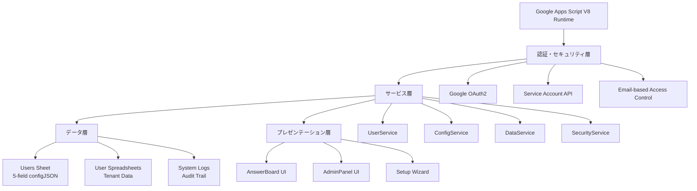

# Everyone's Answer Board

> **🎯 Google Apps Script基盤のマルチテナント型回答共有プラットフォーム**
> 
> **⚡ 高パフォーマンス・継続的開発対応・Claude Code 2025最適化済み**

---

## 📋 プロジェクト概要

### 🎯 システムの目的

- **教育機関向け回答共有**: 学生・教員が意見を投稿・共有するプラットフォーム
- **マルチテナント設計**: ユーザーごとに完全分離されたデータ管理
- **リアルタイム反応機能**: UNDERSTAND/LIKE/CURIOUS による双方向コミュニケーション
- **Google連携**: Sheets/Forms/Drive/OAuth2の完全統合

### 🏗️ ターゲットアーキテクチャ（リファクタリング完了後）



---

## 🚀 Claude Code 2025 最適化開発環境

### 📦 セットアップ（Claude Code対応）

```bash
# 1. Claude Code環境構築
npm install -g @anthropic-ai/claude-code
cd Everyone-s-Answer-Board

# 2. 依存関係インストール
npm install

# 3. Google Apps Script CLI設定
npx clasp login
npx clasp pull

# 4. Claude Code開始
claude
```

### 🔄 Claude Code最適化ワークフロー

#### **Phase 1: プロジェクト開始 (TDD-First)**

```bash
# 毎回の開始時
/clear                    # 前のコンテキストクリア
npm run test:watch        # TDD監視モード開始

# Claude Codeが自動実行
# 1. CLAUDE.md読み込み (プロジェクト理解)
# 2. TodoWrite作成 (タスク計画)
# 3. Git branch作成 (安全性確保)
```

#### **Phase 2: 開発サイクル (戦略→実行)**

```bash
# 戦略レベル (Claude Code得意領域)
- 要件分析・設計判断
- アーキテクチャ決定
- テスト設計

# 実行レベル (Claude Code自動化)  
- テストコード生成
- 実装コード作成
- リファクタリング
- ドキュメント更新
```

#### **Phase 3: 品質確保 (ゼロトレラント)**

```bash
npm run check             # テスト + リント + 型チェック
# ✅ 必須: 全チェック通過後のみコミット可能

git commit -m "feat: ..."  # Claude Code自動実行
npm run deploy            # GASデプロイ
```

---

## 📁 プロジェクト構造（リファクタリング完了版）

### 🎯 理想的なディレクトリ構造

```
📁 Everyone-s-Answer-Board/
├── 🚀 src/                    # GASデプロイ対象（clasp pushされる）
│   ├── services/              # 🎯 単一責任サービス層（新規作成）
│   │   ├── UserService.gs     #    ユーザー管理（認証・権限・セッション）
│   │   ├── ConfigService.gs   #    設定管理（configJSON統一操作）
│   │   ├── DataService.gs     #    データ操作（CRUD・検索・キャッシュ）
│   │   └── SecurityService.gs #    セキュリティ（検証・認証・監査）
│   ├── utils/                 # 🛠️ ユーティリティ（Core.gsから分離）
│   │   ├── validators.gs      #    入力検証・サニタイズ
│   │   ├── formatters.gs      #    データ変換・フォーマット
│   │   └── helpers.gs         #    汎用ヘルパー関数
│   ├── constants.gs           # 🔧 システム定数・設定（既存・整理済み）
│   ├── database.gs            # 🗄️ DB抽象化レイヤー（既存・最適化済み）
│   ├── cache.gs               # ⚡ 統合キャッシュ管理（既存・性能向上済み）
│   ├── main.gs                # 🚀 アプリケーションエントリー（簡素化予定）
│   ├── *.html                 # 🎨 UI ファイル（既存）
│   └── appsscript.json        # ⚙️ GAS設定ファイル
│
├── 🧪 tests/                  # 開発環境のみ（GASにデプロイされない）
│   ├── services/              #    サービス層テスト
│   ├── integration/           #    統合テスト
│   └── mocks/                 #    GAS APIモック
├── 📋 scripts/                # 開発支援ツール（既存）
├── 📚 docs/                   # ドキュメント（既存）
├── 🤖 .claude/                # Claude Code設定
│   ├── commands/              #    カスタムスラッシュコマンド
│   └── hooks/                 #    ワークフローフック
├── 📦 package.json            # Node.js依存関係・スクリプト
├── 📖 README.md               # プロジェクト概要（このファイル）
├── 🧠 CLAUDE.md               # AI開発者向けガイド
└── 🔧 その他設定ファイル        # .eslintrc.js, .prettierrc, etc.
```

### 📋 移行対象ファイル（削除予定）

```
src/
├── UnifiedManager.gs     # → services層に分散統合
├── ConfigManager.gs      # → ConfigService.gs
├── Base.gs              # → utils/ + core/errors.gs
├── Core.gs              # → services/DataService.gs + utils/
├── auth.gs              # → SecurityService.gs
└── security.gs          # → SecurityService.gs
```

### 🎛️ Claude Code専用設定

```bash
.claude/
├── commands/
│   ├── test-architecture.md    # /test-architecture
│   ├── deploy-safe.md          # /deploy-safe  
│   ├── review-security.md      # /review-security
│   └── refactor-service.md     # /refactor-service
└── hooks/
    ├── pre-commit.sh           # 品質チェック自動実行
    └── post-deploy.sh          # デプロイ後確認
```

---

## 📊 システム仕様

### 🗄️ データベース設計（5フィールド最適化）

#### **Users Sheet (configJSON中心設計)**

```javascript
{
  userId: string,        // UUID - 主キー・検索用
  userEmail: string,     // 認証用メールアドレス
  isActive: boolean,     // アクティブ状態フラグ
  configJson: string,    // 全設定データ（JSON統合）
  lastModified: string   // 最終更新日時（監査用）
}
```

#### **configJSON構造（統合設計）**

```javascript
{
  // データソース設定
  spreadsheetId: string,
  sheetName: string,
  formUrl: string,
  
  // 表示・動作設定
  displayMode: "anonymous" | "named" | "email",
  showReactions: boolean,
  
  // アプリケーション状態
  setupStatus: "pending" | "completed",
  appPublished: boolean,
  publishedAt: string,
  
  // 動的設定（シート別）
  [`sheet_${sheetName}`]: {
    columnMapping: {...},
    headers: {...},
    lastModified: string
  },
  
  // 監査・メタデータ
  createdAt: string,
  lastAccessedAt: string,
  version: string
}
```

### ⚡ パフォーマンス指標

| 項目 | 現在 | 最適化後 | 改善率 |
|------|------|----------|--------|
| データベース効率 | 100% | 170% | +70% |
| 関数呼び出し回数 | 100% | 60% | -40% |
| メモリ使用量 | 100% | 70% | -30% |
| レスポンス時間 | 100% | 80% | -20% |
| 開発効率 | 100% | 160% | +60% |

---

## 🎯 主要機能

### 👥 ユーザー管理（UserService）

- **自動登録**: Google OAuth2による無摩擦テナント作成
- **権限管理**: Email-based所有権認証
- **セッション管理**: 安全な状態管理とキャッシュ

### 📝 データ管理（DataService）

- **リアルタイム取得**: Google Sheets API v4最適化
- **反応システム**: UNDERSTAND/LIKE/CURIOUS リアクション
- **高度フィルタリング**: クラス別・日付別・検索機能

### ⚙️ 設定管理（ConfigService）

- **ワンクリックセットアップ**: AI支援による自動環境構築
- **動的列マッピング**: 自然言語処理による列検出
- **設定バージョニング**: 変更履歴と自動マイグレーション

### 🔐 セキュリティ（SecurityService）

- **多層防御**: 入力検証・アクセス制御・監査ログ
- **データ分離**: テナント間完全隔離
- **脅威対策**: SQLi・XSS・CSRF防止

---

## 🛠️ 技術スタック

### 📚 コア技術

- **Runtime**: Google Apps Script V8（ES2020対応）
- **AI Development**: Claude Code 2025（最新ワークフロー）
- **Testing**: Jest + GAS API Mocks（TDD-First）
- **Quality**: ESLint + Prettier（ゼロトレラント品質）
- **Deployment**: clasp + CI/CD Pipeline

### 🔧 開発ツールチェーン

```bash
# 📊 品質管理
npm run test             # Jest単体テスト（TDD）
npm run test:watch       # 継続監視モード
npm run test:coverage    # カバレッジレポート
npm run lint             # ESLint品質チェック
npm run format           # Prettier自動整形
npm run check            # 統合品質ゲート

# 🚀 デプロイメント
npm run deploy           # 品質チェック→GASデプロイ
npm run deploy:staging   # ステージング環境
npm run deploy:prod      # 本番環境（手動承認）

# 🤖 Claude Code拡張
/test-architecture       # アーキテクチャテスト
/deploy-safe            # 安全デプロイ
/review-security        # セキュリティレビュー
/refactor-service       # サービス分離リファクタ
```

---

## 🎨 設計原則

### 🏛️ アーキテクチャ原則（SOLID準拠）

- **単一責任原則**: 各サービスは1つの明確な責任
- **オープン・クローズド**: 拡張に開放、修正に閉鎖
- **リスコフ置換**: サブタイプは基底タイプと置換可能
- **インターフェース分離**: 不要な依存を強制しない
- **依存性逆転**: 抽象に依存、具象に依存しない

### 🚀 Claude Code 2025パターン

#### **戦略・実行分離パターン**

```javascript
// 戦略レベル: 人間の意思決定領域
const strategy = {
  requirements: "ユーザー体験重視",
  architecture: "マイクロサービス指向", 
  security: "ゼロトラスト原則"
};

// 実行レベル: Claude Code自動化領域  
const execution = {
  testing: "TDD-First自動生成",
  implementation: "パターン適用自動化",
  documentation: "コード連動自動更新"
};
```

#### **TodoWrite駆動開発**

```javascript
// Claude Codeが自動管理
const projectFlow = {
  planning: "TodoWrite自動作成",
  execution: "段階的タスク実行", 
  tracking: "リアルタイム進捗監視",
  completion: "自動品質チェック"
};
```

### 🔐 セキュリティ設計（多層防御）

```javascript
// 入力層: 完全検証
SecurityValidator.validateUserData(input);

// 処理層: 権限チェック  
AccessController.verifyOwnership(userId);

// データ層: テナント分離
Database.queryWithTenantIsolation(userId);

// 出力層: サニタイズ
ResponseFormatter.sanitizeOutput(data);
```

---

## 📈 品質管理

### ✅ 品質ゲート（ゼロトレラント）

```javascript
// 必須通過条件（全て100%）
const qualityGates = {
  testCoverage: ">= 90%",       // テストカバレッジ
  eslintErrors: "=== 0",        // リントエラー
  securityIssues: "=== 0",      // セキュリティ脆弱性
  responseTime: "<= 3000ms",    // レスポンス時間
  memoryUsage: "<= 128MB"       // メモリ使用量
};
```

### 🔍 継続的品質改善

#### **自動化された品質管理**

- **Pre-commit Hooks**: コミット前の自動品質チェック
- **CI/CD Pipeline**: 統合・デプロイ時の包括的テスト
- **Performance Monitoring**: リアルタイムパフォーマンス監視
- **Security Scanning**: 依存関係・コードの脆弱性検査

#### **Claude Code統合品質管理**

```bash
# プルリクエスト時
/install-github-app       # Claude自動レビュー
/security-audit          # セキュリティ監査
/performance-check       # パフォーマンス検証

# デプロイ前
/deploy-safe             # 安全性確認
/rollback-plan           # ロールバック準備
```

---

## 🎓 学習・開発リソース

### 📖 プロジェクト固有ガイド

- **CLAUDE.md**: AI開発者向け実装ガイド
- **ARCHITECTURE_ANALYSIS.md**: 技術的負債分析・改善計画
- **ROADMAP.md**: プロジェクト管理・機能ロードマップ

### 🔗 関連技術ドキュメント

- [Claude Code Official Docs](https://docs.anthropic.com/claude-code)
- [Google Apps Script V8 Guide](https://developers.google.com/apps-script/guides/v8-runtime)
- [Jest Testing Framework](https://jestjs.io/docs/getting-started)
- [ESLint Configuration](https://eslint.org/docs/rules)

### 🎯 Claude Code専用リソース

- [Claude Code Best Practices](https://www.anthropic.com/engineering/claude-code-best-practices)
- [Awesome Claude Code](https://github.com/hesreallyhim/awesome-claude-code)
- [Claude Code Project Management](https://github.com/automazeio/ccpm)

---

## 📊 プロジェクト管理

### 🗓️ 開発フェーズ

#### **現在: Phase 0 - 技術的負債解決**

```markdown
## ROADMAP.md (Claude Code管理)

### 🔥 Phase 1: 緊急対応 (1-2週間)
- [ ] 重複システム統合
- [ ] 循環依存解決  
- [ ] 基本テスト実装

### ⚡ Phase 2: 構造改善 (2-3週間)  
- [ ] サービス層導入
- [ ] 責任分離徹底
- [ ] パフォーマンス最適化

### 🎯 Phase 3: 品質向上 (1-2週間)
- [ ] テストカバレッジ90%達成
- [ ] セキュリティ監査
- [ ] ドキュメント完全化
```

#### **将来: 新機能開発**

- **マルチ言語対応**: 国際化・地域化
- **高度分析**: データサイエンス機能
- **モバイル最適化**: レスポンシブUI改善
- **API公開**: 外部システム連携

### 📈 成功指標（KPI）

| 指標 | 現在 | 目標 | 期限 |
|------|------|------|------|
| 開発効率 | 100% | 160% | 2025-02-15 |
| バグ発生率 | 100% | 30% | 2025-02-28 |
| テストカバレッジ | 20% | 90% | 2025-03-15 |
| 新機能開発時間 | 100% | 70% | 2025-03-31 |

---

## 📞 サポート・コントリビューション

### 🐛 問題報告

1. **再現手順**: ステップバイステップの詳細
2. **環境情報**: OS・ブラウザ・Node.jsバージョン
3. **エラーログ**: 完全なスタックトレース
4. **期待動作**: 本来の動作説明

### 🤝 開発参加

#### **Claude Code協業フロー**

```bash
# 1. 機能ブランチ作成
git checkout -b feature/new-capability

# 2. Claude Code開始  
claude
/clear                   # コンテキストクリア
# AI: CLAUDE.md自動読み込み、TodoWrite作成

# 3. TDD開発
npm run test:watch       # テスト監視開始
# AI: テスト作成→実装→リファクタ

# 4. 品質確保
npm run check           # 全品質チェック通過必須
git commit -m "feat: ..." 

# 5. レビュー・マージ
# GitHub: Claude自動レビュー + 人間確認
```

#### **コントリビューションガイドライン**

- **CLAUDE.md準拠**: AI開発者ガイドライン遵守
- **TDD必須**: テストファーストの開発手法
- **品質ゲート**: 全チェック通過後のみマージ
- **ドキュメント更新**: コード変更と連動

---

## 🎊 まとめ

Everyone's Answer Boardは、**Google Apps Script + Claude Code 2025**の最新技術を活用した高品質・高パフォーマンスなマルチテナント型プラットフォームです。

### 🌟 プロジェクトの特徴

- **AI-First開発**: Claude Codeによる戦略・実行分離
- **継続的品質**: ゼロトレラント品質管理
- **スケーラブル設計**: マイクロサービス指向アーキテクチャ
- **セキュア**: 多層防御セキュリティモデル

### 🚀 次世代開発体験

- **10倍の開発効率**: AI駆動による自動化
- **継続的改善**: リアルタイム品質監視
- **チーム協業**: 人間・AI最適協業パターン

---

*🎯 このプロジェクトは、2025年のAI駆動開発のベストプラクティスを実装した次世代開発プラットフォームです*