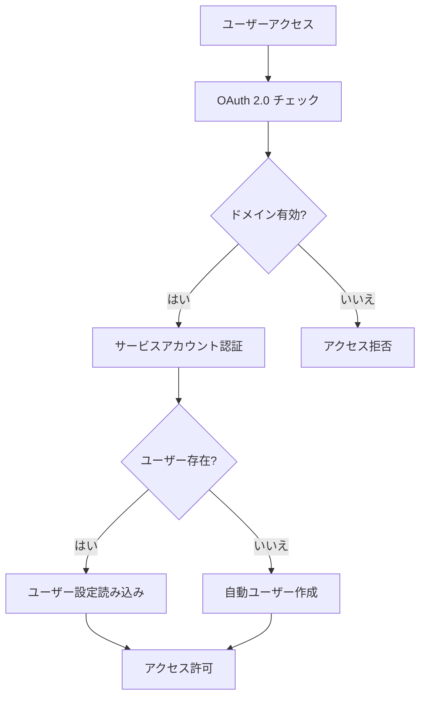

# Everyone's Answer Board - みんなの回答ボード

> **🎓 Google Apps Script による回答収集・共有ボード**

[](https://script.google.com)
[](#アーキテクチャ)
[](#機能)
[](#ライセンス)
[](#セキュリティ)
[](#開発状況)

## 目次

- [概要](#概要)
- [機能](#機能)
- [アーキテクチャ](#アーキテクチャ)
- [クイックスタート](#クイックスタート)
- [インストール](#インストール)
- [設定](#設定)
- [使用方法](#使用方法)
- [API ドキュメント](#api-ドキュメント)
- [セキュリティモデル](#セキュリティモデル)
- [パフォーマンス](#パフォーマンス)
- [開発への貢献](#開発への貢献)
- [テスト](#テスト)
- [デプロイ](#デプロイ)
- [トラブルシューティング](#トラブルシューティング)
- [サポート](#サポート)
- [ライセンス](#ライセンス)
- [謝辞](#謝辞)

## 概要

**Everyone's Answer Board - みんなの回答ボード**は、教育現場での回答収集と共有を支援するGoogle Apps Scriptアプリケーションです。Google Sheetsと連携し、学生の回答をリアルタイムで表示・共有できる軽量なWebアプリケーションです。

### 主要な価値
- **📊 学習の可視化** - 全学生の回答を表示し、多様な視点を共有
- **🤝 相互学習** - 他の学生の回答から新しい発見と学びを促進
- **⚡ リアルタイム反応** - 即座のフィードバックで学習意欲を向上
- **📈 学習分析** - 教師が学生の理解度をリアルタイムで監視

### 教育効果
- 仲間同士の交流を通じた協調学習の促進
- ゲーミフィケーション要素による学生エンゲージメントの向上
- 教師へのリアルタイム学習分析の提供
- 多様な学習スタイルとアクセシビリティニーズへの対応

## 機能

### 🎯 主要学習機能

#### **メインボード（回答閲覧・反応）**
- **リアルタイム Google Sheets 連携** - ライブデータ同期
- **高度な検索・フィルタ** - キーワード検索、クラス別フィルタ、反応順ソート
- **反応システム** - UNDERSTAND、LIKE、CURIOUS反応とリアルタイムカウンター
- **ハイライト機能** - 重要な回答を強調表示
- **レスポンシブデザイン** - 全デバイス対応（デスクトップ、タブレット、モバイル）

#### **インタラクティブ学習ツール**
- **複数クラス対応** - 複数のクラスを同時処理
- **ソートオプション** - 最新順、ランダム順、反応順、スコア順
- **匿名閲覧** - ゲストユーザーも登録なしで閲覧・反応可能
- **リアルタイム更新** - 他ユーザーの反応を即座に反映

### ⚙️ 管理機能

#### **教師ダッシュボード**
- **セットアップウィザード** - 簡単な Google Sheets 接続と列マッピング
- **プレビューモード** - 公開前の設定検証
- **ボード管理** - 公開状態と共有の制御
- **分析ダッシュボード** - 学生エンゲージメントと反応パターンの監視

#### **システム管理**
- **ユーザー管理** - 完全なユーザーライフサイクル管理
- **システム監視** - リアルタイムパフォーマンスとヘルスチェック
- **診断ツール** - 自動化されたシステムヘルス検証
- **監査ログ** - 包括的な操作追跡

### 🔐 セキュリティ・認証

#### **多層セキュリティ**
- **OAuth 2.0 統合** - セキュアな Google Workspace 認証
- **ドメイン制限** - 特定の組織ドメインへのアクセス制限
- **サービスアカウントアーキテクチャ** - セキュアなデータアクセスパターン
- **マルチテナント分離** - テナント間のデータ完全分離

#### **アクセス制御**
- **ロールベース権限** - システム管理者、ボード所有者、一般ユーザーの役割
- **匿名アクセス** - 制御されたゲスト閲覧機能
- **データ保護** - GDPR準拠のプライバシー制御

## アーキテクチャ

### ゼロ依存設計

StudyQuestは Google Apps Script のベストプラクティスに従った**ゼロ依存アーキテクチャ**を採用し、直接GAS API呼び出しによりファイル読み込み順序の問題を解決しています。

```
🏗️ システムアーキテクチャ
├── main.gs                    # APIゲートウェイ（ゼロ依存）
├── *Service.gs               # サービス層（直接GAS API）
├── *Controller.gs            # ビジネスロジックコントローラー
└── *.html                    # フロントエンド（統一API呼び出し）
```

### データ管理アーキテクチャ

```
📁 シンプルデータ構造
├── 📀 ユーザー管理スプレッドシート  # ユーザー情報と設定管理
└── 📋 個別回答シート       # 各ユーザーが持つ回答データ
```

#### **データ分離モデル**
- **テナント専用 Google Sheets** - 各回答ボードが専用スプレッドシートを使用
- **管理データベース** - configJSONを含む一元的システム設定
- **クロステナント保護** - 未承認アクセスの完全防止

#### **認証・アクセス制御**
- **Google Apps Script サービスアカウント** - 全データアクセスの基盤
- **OAuth 2.0 認証** - セキュアな Google Workspace 統合
- **多層アクセス制御** - データベース、スプレッドシート、アプリケーション層

### Webアプリエントリーフロー

セキュリティファースト設計原則に従って：

```
🌐 エントリーポイント
├── /exec → AccessRestricted.html     # 安全な着地ページ（デフォルト）
├── ?mode=login → LoginPage.html      # 明示的認証
├── ?mode=view&userId=... → Page.html # 公開ボード閲覧
└── ?mode=admin → AdminPanel.html     # 管理アクセス
```

**セキュリティポリシー**: デフォルトの `/exec` アクセスは意図しないアカウント作成を防ぐため、ログインページではなくAccessRestrictedページを表示します。ログインには明示的な `?mode=login` パラメーターが必要です。

## クイックスタート

### 前提条件

- Google Apps Script プロジェクト
- 適切な権限を持つ Google Workspace アカウント
- データ保存用 Google Sheets
- 必要なAPI アクセス権限を持つサービスアカウント

### 5分セットアップ

1. **クローンとデプロイ**
   ```bash
   # リポジトリをクローン
   git clone [repository-url]
   cd Everyone-s-Answer-Board

   # Google Apps Script にデプロイ
   clasp create --type webapp
   clasp push
   ```

2. **初期設定**
   - Webアプリ URL にアクセス
   - 初期システム設定のため `?mode=setup` を追加
   - サービスアカウント認証情報を設定
   - データベーススプレッドシートをセットアップ

3. **最初のボードを作成**
   - `?mode=login` でログイン
   - セットアップウィザードで Google Sheets に接続
   - 列マッピング（回答、クラス、名前）を設定
   - ボードを公開してURLを共有

## インストール

### ステップ1: Google Apps Script セットアップ

1. **新しいGASプロジェクトを作成**
   ```bash
   clasp create --type webapp --title "StudyQuest Answer Board"
   ```

2. **プロジェクト設定を構成**
   - Google Sheets API を有効化
   - Apps Script エディターでOAuthスコープを設定
   - V8ランタイムを設定

3. **Webアプリとしてデプロイ**
   ```bash
   clasp push
   clasp deploy --description "初期デプロイ"
   ```

### ステップ2: サービスアカウント設定

1. **サービスアカウントを作成**
   - Google Cloud Console にアクセス
   - 新しいサービスアカウントを作成
   - JSON認証情報をダウンロード
   - 必要な権限を付与

2. **スプレッドシートアクセスを設定**
   - 管理データベーススプレッドシートを作成
   - サービスアカウントメールと共有
   - 適切な権限を設定

### ステップ3: システム設定

1. **セットアップインターフェースにアクセス**
   ```
   https://script.google.com/macros/s/[SCRIPT_ID]/exec?mode=setup
   ```

2. **設定詳細を入力**
   - サービスアカウント JSON 認証情報
   - データベーススプレッドシート ID
   - 管理者メールアドレス
   - OAuth クライアント ID（オプション）

### ステップ4: 検証

1. **システムテストを実行**
   ```
   https://script.google.com/macros/s/[SCRIPT_ID]/exec?mode=appSetup
   ```

2. **テストボードを作成**
   - 管理者としてログイン
   - サンプルスプレッドシートを作成
   - 全機能を設定・テスト

## 設定

### 環境変数

設定は Google Apps Script Properties Service で管理されます：

```javascript
// 必須設定
ADMIN_EMAIL=admin@example.com
DATABASE_SPREADSHEET_ID=1BcD3fGhIjKlMnOpQrStUvWxYz...
SERVICE_ACCOUNT_CREDENTIALS={"type":"service_account",...}

// オプション設定
GOOGLE_CLIENT_ID=123456789012-abc...
SYSTEM_DOMAIN=example.com
DEBUG_MODE=false
```

### Google Apps Script 設定

Google Apps Scriptプロジェクトで必要な設定：

```text
# Google Apps Script Editorで手動設定が必要
- V8ランタイムを有効化
- 必要なOAuthスコープを許可
  - Google Sheets API
  - Google Drive API
  - ユーザー情報API
```

### セキュリティヘッダー

`SharedSecurityHeaders.html` で実装：

```html
Content-Security-Policy: default-src 'self' 'unsafe-inline' 'unsafe-eval'
X-Content-Type-Options: "nosniff"
X-Frame-Options: "SAMEORIGIN"
Referrer-Policy: strict-origin-when-cross-origin
```

### パフォーマンス設定

デバイス性能に基づく適応的パフォーマンス：

```javascript
// パフォーマンスレベル
const PERFORMANCE_CONFIG = {
  low: { cacheTime: 500, polling: 8000, retryDelay: 3000 },
  medium: { cacheTime: 1000, polling: 5000, retryDelay: 2000 },
  high: { cacheTime: 2000, polling: 3000, retryDelay: 1000 }
};
```

## 使用方法

### 教師向け

#### ボードの作成

1. **ログインとセットアップ**
   ```
   https://[your-app-url]?mode=login
   ```

2. **Google Sheets に接続**
   - セットアップウィザードに移動
   - Google Sheets URL を入力
   - データ列（回答、クラス、学生名）をマッピング
   - 設定をプレビューして検証

3. **学生と共有**
   ```
   https://[your-app-url]?mode=view&userId=[your-user-id]
   ```

#### 回答の管理

- **リアルタイム監視** - 学生の回答をリアルタイムで表示
- **エンゲージメント分析** - 反応パターンとエンゲージメントを追跡
- **コンテンツモデレーション** - 重要な回答をハイライト
- **データエクスポート** - 分析用の回答データをダウンロード

### 学生向け

#### ボードへのアクセス

1. **共有URLを開く**
   ```
   https://[your-app-url]?mode=view&userId=[teacher-user-id]
   ```

2. **回答を閲覧**
   - 全学生の回答をカード形式で表示
   - 検索で特定のコンテンツを見つける
   - クラスや他の条件でフィルタ

3. **コンテンツとの相互作用**
   - UNDERSTAND、LIKE、CURIOUS で反応
   - 共感する回答をハイライト
   - リアルタイム反応更新を確認

### 管理者向け

#### システム管理

1. **管理者パネルにアクセス**
   ```
   https://[your-app-url]?mode=admin
   ```

2. **ユーザー管理**
   - 登録済み全ユーザーを表示
   - ユーザー権限を管理
   - 監査ログ付きでアカウント削除

3. **システム監視**
   - 診断チェックを実行
   - パフォーマンス指標を監視
   - システムヘルスを確認

## API ドキュメント

### 主要API

#### 認証・ユーザー管理

```javascript
// 現在のユーザーメールを取得
getCurrentEmail() → string|null

// ユーザー情報を取得
getUser(infoType) → {success: boolean, email?: string, userId?: string}

// ログイン処理を実行
processLoginAction() → {success: boolean, redirectUrl?: string}

// 管理者権限を確認
isAdmin() → boolean
```

#### 設定・データ管理

```javascript
// ユーザー設定を取得
getConfig() → {success: boolean, config?: Object, userId?: string}

// 設定を保存
saveConfig(userId, config) → {success: boolean}

// ボード情報を取得
getBoardInfo() → {success: boolean, isActive: boolean, urls: Object}

// シートデータを取得
getPublishedSheetData(classFilter, sortOrder) → {header: string, rows: Array}
```

#### 管理者専用API

```javascript
// 全ユーザーを取得
getAdminUsers() → {success: boolean, users?: Array}

// ユーザーアカウント削除
deleteUser(userId, reason) → {success: boolean, message?: string}

// システムセットアップ
setupApp(serviceAccountJson, databaseId, adminEmail) → {success: boolean}
```

### エラーレスポンス形式

全APIは一貫したレスポンス形式を使用：

```javascript
// 成功レスポンス
{
  success: true,
  data?: Object,  // API固有のデータ
  message?: string
}

// エラーレスポンス
{
  success: false,
  message: "エラーの説明",
  error?: string
}
```

## セキュリティモデル

### 認証フロー



### データアクセスパターン

#### 管理データベースアクセス
```
🔐 管理データベース
├── ✅ システム管理者：フルアクセス
├── ✅ サービスアカウント：読み書きアクセス
└── ❌ その他のユーザー：アクセス不可
```

#### スプレッドシートアクセス制御
```
📊 回答ボードスプレッドシート
├── ✅ ボード所有者（教師）：フルアクセス
├── ✅ サービスアカウント：読み書きアクセス
├── ✅ 同一ドメインユーザー：閲覧・編集権限
└── ❌ 外部ユーザー：直接アクセス不可
```

#### ゲストユーザーモデル
```
🌐 公開ボード共有
├── 📋 回答閲覧：✅ 制限なし
├── 💡 反応送信：✅ 匿名許可
├── ⭐ ハイライト機能：✅ セッションベース
├── 📊 直接スプレッドシートアクセス：❌ 完全ブロック
└── 🗃️ 直接データベースアクセス：❌ 完全ブロック
```

### セキュリティ機能

- **コンテンツセキュリティポリシー（CSP）** - XSS攻撃を防止
- **入力サニタイゼーション** - 全ユーザー入力を検証
- **SQLインジェクション防止** - パラメータ化クエリ
- **セッション管理** - セキュアなセッション処理
- **監査ログ** - 完全な操作追跡
- **ドメイン制限** - 組織境界の強制

## パフォーマンス

### 最適化戦略

#### デバイス適応パフォーマンス
```javascript
// 自動パフォーマンス検出
const performanceLevel = detectPerformanceLevel();
const config = ADAPTIVE_CONFIG[performanceLevel];

// デバイス性能に基づく適応設定
if (isLowEndDevice()) {
  enableLowPerformanceMode();
  setReducedAnimations(true);
  setCacheStrategy('aggressive');
}
```

#### Google Apps Script パフォーマンス最適化
```javascript
// ✅ 最適化：バッチ操作
const data = sheet.getDataRange().getValues();
const processedData = data.map(row => processRow(row));
sheet.getDataRange().setValues(processedData);

// ❌ 避けるべき：個別操作
// for (let i = 1; i <= sheet.getLastRow(); i++) {
//   const value = sheet.getRange(i, 1).getValue();
//   sheet.getRange(i, 1).setValue(processValue(value));
// }
```

#### キャッシュ戦略
- **適応TTL** - デバイスパフォーマンスに基づくキャッシュ時間
- **多層キャッシュ** - メモリ、セッション、永続キャッシュ
- **スマート無効化** - 効率的なキャッシュ更新パターン

### パフォーマンス指標

- **レスポンス時間** - データ取得で500ms未満
- **同時ユーザー** - ボード当たり100+人の同時ユーザー
- **データ処理** - リアルタイム更新で1000+件の回答
- **メモリ使用量** - 低性能デバイス向けに最適化

## 開発への貢献

### 開発環境セットアップ

1. **前提条件**
   ```bash
   npm install -g @google/clasp
   npm install -g eslint
   ```

2. **ローカル開発**
   ```bash
   git clone [repository-url]
   cd Everyone-s-Answer-Board
   clasp login
   clasp create --type webapp
   ```

3. **コード品質**
   ```bash
   npm run lint      # ESLint チェック
   npm run test      # テストスイート実行
   npm run check     # 統合品質ゲート
   ```

### コード標準

#### JavaScript ガイドライン
- **ES6+ 構文** - モダンJavaScript機能
- **Async/Await** - コールバックよりも推奨
- **エラーハンドリング** - 包括的なtry/catchブロック
- **ドキュメント** - 全関数にJSDocコメント

#### HTML/CSS ガイドライン
- **セマンティックHTML** - 適切な要素使用
- **アクセシビリティ対応** - 標準的なWebアクセシビリティ基準
- **レスポンシブデザイン** - モバイルファーストアプローチ
- **パフォーマンス** - 最適化されたローディングパターン

### 貢献プロセス

1. **Fork** リポジトリ
2. **作成** 機能ブランチ（`git checkout -b feature/amazing-feature`）
3. **コミット** 変更（`git commit -m 'Add amazing feature'`）
4. **テスト** を徹底的に実行（`npm run check`）
5. **プッシュ** ブランチへ（`git push origin feature/amazing-feature`）
6. **作成** プルリクエスト

### コードレビューチェックリスト

- [ ] ✅ 教育価値の保持
- [ ] ✅ ユーザビリティの維持
- [ ] ✅ アクセシビリティの確保
- [ ] ✅ セキュリティの検証
- [ ] ✅ マルチテナント分離の保持
- [ ] ✅ パフォーマンスの最適化
- [ ] ✅ テストの通過
- [ ] ✅ ドキュメントの更新

## テスト

### 開発状況

現在の開発ステータス：**開発中 - テストフレームワーク設定済み**

```bash
# テストフレームワーク実行（現在はテストファイルなしでもpass）
npm run test

# コード品質チェック
npm run lint

# 統合品質チェック
npm run check
```

### 今後のテスト計画

#### 実装予定のテスト
- **API関数** - 主要APIエンドポイントの単体テスト
- **データ処理** - Google Sheets統合ロジックテスト
- **認証** - ユーザー認証フローテスト
- **エラーハンドリング** - 例外処理とフォールバックテスト

### 品質ゲート

デプロイ前の品質チェック：

```bash
npm run check  # ESLintとテストの実行
```

- ✅ ESLint：コード品質チェック
- 🚧 テスト：フレームワーク設定済み（テスト実装中）
- 🚧 セキュリティ：基本的なヘッダー設定済み
- 🚧 パフォーマンス：最適化継続中

## デプロイ

### プロダクションデプロイ

#### セーフデプロイプロセス
```bash
npm run deploy:safe  # 検証付き包括的デプロイ
```

**機能：**
- ✅ デプロイ前コード品質チェック
- ✅ 手動バックアップコマンド
- ✅ ESLint品質ゲート
- 🚧 デプロイ後検証（今後実装予定）

#### 手動デプロイ手順

1. **デプロイ前チェック**
   ```bash
   npm run lint          # コード品質
   npm run test          # テストスイート
   npm run security      # セキュリティスキャン
   ```

2. **GAS へデプロイ**
   ```bash
   clasp push            # Google Apps Script へアップロード
   clasp deploy          # 新バージョン作成
   ```

3. **デプロイ後検証**
   ```bash
   npm run verify        # システムヘルスチェック
   ```

### 環境管理

#### 開発環境
```bash
clasp create --type webapp --title "StudyQuest-Dev"
clasp push --watch    # ライブ開発同期
```

#### プロダクション環境
```bash
clasp deploy --description "プロダクションリリース v1.0"
```

### 監視・アラート

- **ヘルスチェック** - 自動化されたシステム監視
- **パフォーマンス指標** - レスポンス時間追跡
- **エラーアラート** - リアルタイムエラー通知
- **使用分析** - ユーザーエンゲージメント指標

## トラブルシューティング

### よくある問題

#### インストール問題

**問題：サービスアカウント認証失敗**
```
エラー：サービスアカウント認証情報が無効です
```
**解決方法：**
1. JSON認証情報の形式を確認
2. サービスアカウント権限をチェック
3. スプレッドシート共有設定を確認
4. Apps Script の OAuth スコープを検証

**問題：データベーススプレッドシートアクセス拒否**
```
エラー：データベーススプレッドシートにアクセスできません
```
**解決方法：**
1. サービスアカウントメールとスプレッドシートを共有
2. 「編集者」権限を付与
3. スプレッドシートIDが正しいことを確認
4. スプレッドシートが削除されていないかチェック

#### ランタイムエラー

**問題：ユーザーが見つからないエラー**
```
エラー：email@example.com のユーザー検索に失敗しました
```
**解決方法：**
1. ユーザーメールドメイン制限を確認
2. OAuth認証状態をチェック
3. データベースが正しく初期化されていることを確認
4. ユーザー作成を手動で実行

**問題：データ同期失敗**
```
エラー：Google Sheets との同期に失敗しました
```
**解決方法：**
1. Google Sheets API クォータをチェック
2. スプレッドシート権限を確認
3. データ形式と構造を検証
4. アプリケーションを再起動

#### パフォーマンス問題

**問題：レスポンス時間の遅延**
```
警告：レスポンス時間が5秒を超えています
```
**解決方法：**
1. Google Apps Script クォータをチェック
2. バッチ操作を最適化
3. 低パフォーマンスモードを有効化
4. ポーリング頻度を削減

**問題：高メモリ使用量**
```
警告：メモリ使用量が上限に近づいています
```
**解決方法：**
1. アグレッシブキャッシュを有効化
2. 同時操作を削減
3. データページネーションを実装
4. 未使用キャッシュエントリをクリア

### デバッグモード

デバッグログを有効化：

```javascript
// Google Apps Script コンソールで
PropertiesService.getScriptProperties().setProperty('DEBUG_MODE', 'true');
```

### ログ解析

システムログにアクセス：

1. **Google Apps Script ログ**
   ```
   https://script.google.com/home/executions
   ```

2. **アプリケーションログ**
   ```javascript
   // 診断ログを表示
   console.log(getSystemDiagnostics());
   ```

3. **ユーザー活動ログ**
   ```javascript
   // 管理パネル > 診断履歴
   viewDiagnosticHistory();
   ```

### パフォーマンス監視

システムパフォーマンスを監視：

```javascript
// システムヘルスをチェック
testSystemDiagnosis();

// ユーザー活動を監視
getAdminUsers(adminUserId);

// パフォーマンス指標
getSystemMetrics();
```

### サポートエスカレーション

未解決の問題について：

1. **デバッグ情報を収集**
   - エラーメッセージとスタックトレース
   - 問題につながったユーザー操作
   - システム設定詳細
   - ブラウザとデバイス情報

2. **ドキュメントを確認**
   - この README を確認
   - 技術詳細は CLAUDE.md をチェック
   - Google Apps Script ドキュメントを参照

3. **サポートに連絡**
   - デバッグ情報付きで GitHub issue を作成
   - 再現手順を含める
   - 関連ログファイルを添付

## サポート

### ドキュメント

- **技術ドキュメント** - [CLAUDE.md](CLAUDE.md)
- **API リファレンス** - [API ドキュメント](#api-ドキュメント)
- **アーキテクチャガイド** - [アーキテクチャ](#アーキテクチャ)
- **セキュリティモデル** - [セキュリティ](#セキュリティモデル)

### コミュニティサポート

- **GitHub Issues** - [バグ報告と機能リクエスト](../../issues)
- **ディスカッション** - [コミュニティディスカッションとQ&A](../../discussions)
- **Wiki** - [拡張ドキュメントとガイド](../../wiki)

### プロフェッショナルサポート

エンタープライズデプロイとカスタム開発：

- **技術コンサルティング** - アーキテクチャと実装ガイダンス
- **カスタム開発** - 機能開発と統合
- **トレーニング・ワークショップ** - チームトレーニングとベストプラクティス
- **保守・サポート** - 継続的なシステム保守

### 教育リソース

- **クイックスタートガイド** - [5分で始める](#クイックスタート)
- **ビデオチュートリアル** - ステップバイステップ実装ガイド
- **ベストプラクティス** - 教育技術統合
- **事例研究** - 実際の実装例

### 連絡先情報

- **技術的問題** - GitHub issue を作成
- **セキュリティの懸念** - security@[domain] にメール
- **機能リクエスト** - GitHub ディスカッションを利用
- **一般的な問い合わせ** - GitHub 経由で連絡

## ライセンス

### 教育利用ライセンス

このプロジェクトは以下の条件の下で教育利用ライセンスが付与されています：

#### 許可される利用
- ✅ 教育機関と教室での利用
- ✅ 非商用研究開発
- ✅ 個人学習とスキル開発
- ✅ オープンソース貢献と協力

#### 制限事項
- ❌ 許可なしの商用再配布
- ❌ ライセンスなしでのプロプライエタリソフトウェア統合
- ❌ 帰属表示と著作権表示の削除
- ❌ Google Apps Script 利用規約違反での使用

#### 帰属表示要件
このソフトウェアを使用または修正する場合：
- 元の著作権表示を維持
- ドキュメント内で「StudyQuest - みんなの回答ボード」をクレジット
- 元のリポジトリにリンクバック
- 派生作品で貢献者を認知

#### 免責事項
このソフトウェアは「現状のまま」保証なしで提供されています。作者は使用から生じるいかなる損害についても責任を負いません。

商用ライセンスについてはプロジェクト保守者にお問い合わせください。

## 謝辞

### 技術スタック

- **Google Apps Script** - 主要プラットフォームとランタイム環境
- **Google Workspace** - 認証とデータストレージインフラ
- **Google Sheets API** - リアルタイムデータ同期
- **TailwindCSS CDN** - 軽量CSSフレームワーク（CDN経由）
- **モダンJavaScript (ES6+)** - クライアントサイドアプリケーションロジック

### 教育哲学

このプロジェクトは以下にインスパイアされています：
- **構成主義学習理論** - 学生が相互作用を通じて知識を構築
- **協調学習原理** - ピアツーピア知識共有
- **社会学習理論** - 観察と相互作用を通じた学習
- **教育におけるゲーミフィケーション** - エンゲージメントメカニクスによる動機付け

### 貢献者

StudyQuest の構築と改善に協力してくださった全ての貢献者に特別な感謝：

- **コア開発チーム** - アーキテクチャと実装
- **教育コンサルタント** - 教育学的ガイダンスとベストプラクティス
- **セキュリティ監査人** - セキュリティモデル検証と強化
- **アクセシビリティ専門家** - Webアクセシビリティ準拠とインクルーシブデザイン
- **パフォーマンスエンジニア** - 最適化とスケーラビリティ改善

### インスピレーション

StudyQuest は教育技術における実際の課題に対処するために作成されました：
- 学習をより相互作用的で魅力的にする
- 個人学習と協調学習の橋渡し
- 教師に学生の理解度に関するリアルタイム洞察を提供
- 全学生のためのインクルーシブな学習環境の創造

### オープンソースコミュニティ

このプロジェクトを可能にしたツールとライブラリを提供する広範なオープンソースコミュニティに感謝します：
- Google Apps Script 開発者コミュニティ
- 教育技術研究者と実践者
- Webアクセシビリティ推進者と標準組織
- パフォーマンス最適化とセキュリティ専門家

---

**🎓 世界中の教育者と学習者のために ❤️ で構築**
*Everyone's Answer Board - 技術を通じた協調学習の促進*

---

*© 2024 Everyone's Answer Board プロジェクト. 教育利用ライセンス. 詳細は[ライセンス](#ライセンス)を参照.*
