<div align="center">

# 🎯 Everyone's Answer Board

### *AI-Powered Multi-Tenant Answer Sharing Platform*

[](https://script.google.com)
[](src/services/)
[](CLAUDE.md)
[](tests/)
[](LICENSE)

**🚀 Real-time collaborative answer sharing with Google Sheets integration**
**⚡ Built with modern AI-driven development practices**

---

[🎯 Features](#features) • [🚀 Quick Start](#quick-start) • [📖 API Documentation](#api-documentation) • [🏗️ Architecture](#architecture) • [🤝 Contributing](#contributing)

</div>

---

## 🎯 Features

<table>
<tr>
<td width="50%">

### 🏢 Multi-Tenant Architecture
- **Isolated User Environments**: Complete data separation per user
- **Google OAuth Integration**: Seamless authentication flow
- **Dynamic Configuration**: Per-tenant customizable settings
- **Scalable Design**: Supports unlimited tenants

</td>
<td width="50%">

### ⚡ Real-Time Collaboration
- **Live Reactions**: UNDERSTAND/LIKE/CURIOUS system
- **Instant Updates**: Real-time data synchronization
- **Response Highlighting**: Interactive answer engagement
- **Auto-Refresh**: Background data updates

</td>
</tr>
<tr>
<td>

### 🔒 Enterprise Security
- **Multi-Layer Defense**: Input validation, access control, audit logs
- **Content Security Policy**: XSS/injection protection
- **Tenant Isolation**: Complete data separation guarantee
- **Security Monitoring**: Comprehensive logging system

</td>
<td>

### 🎨 Modern User Experience
- **Responsive Design**: Mobile-first UI approach
- **Progressive Enhancement**: Works without JavaScript
- **Accessibility**: WCAG 2.1 compliant interface
- **Dark Mode**: User preference support

</td>
</tr>
</table>

---

## 🚀 Quick Start

### Prerequisites

```bash
# Required software
node >= 18.0.0
npm >= 8.0.0
```

### Installation

```bash
# 1. Clone and setup
git clone https://github.com/your-username/Everyone-s-Answer-Board.git
cd Everyone-s-Answer-Board

# 2. Install dependencies
npm install

# 3. Configure Google Apps Script
npm run setup:gas
npx clasp login
npx clasp pull

# 4. Run quality checks
npm run check
```

### First Deployment

```bash
# Deploy to Google Apps Script
npm run deploy

# Open GAS editor (optional)
npx clasp open

# View execution logs
npx clasp logs
```

### 🎯 Usage Example

```javascript
// Access your deployed web app
const webAppUrl = "https://script.google.com/macros/s/YOUR_ID/exec";

// Users navigate through the flow:
// 1. Login page (OAuth authentication)
// 2. Setup page (spreadsheet configuration)
// 3. Main board (real-time collaboration)
```

---

## 🏗️ Architecture

### 📋 System Overview

```mermaid
graph TB
    A[🌐 Web Interface] --> B[🚪 main.gs Entry Point]
    B --> C[🎛️ Controllers Layer]
    B --> D[🔧 Services Layer]
    B --> E[🗄️ Infrastructure Layer]

    C --> C1[AdminController]
    C --> C2[DataController]
    C --> C3[FrontendController]
    C --> C4[SystemController]

    D --> D1[UserService]
    D --> D2[ConfigService]
    D --> D3[DataService]
    D --> D4[SecurityService]

    E --> E1[DatabaseService]
    E --> E2[CacheService]
    E --> E3[Google APIs]

    style A fill:#e1f5fe
    style B fill:#f3e5f5
    style C fill:#e8f5e8
    style D fill:#fff3e0
    style E fill:#fce4ec
```



### 📁 Directory Structure

```
src/
├── 🚪 main.gs                    # HTTP entry point & routing
├── 🎛️ controllers/               # Request handlers (NEW)
│   ├── AdminController.gs        # Admin panel operations
│   ├── DataController.gs         # Data operations
│   ├── FrontendController.gs     # Frontend APIs
│   └── SystemController.gs       # System management
├── 🔧 services/                  # Business logic layer
│   ├── UserService.gs           # User authentication & management
│   ├── ConfigService.gs         # Configuration management
│   ├── DataService.gs           # Spreadsheet operations
│   └── SecurityService.gs       # Security & permissions
├── 🗄️ infrastructure/            # Data access layer
│   ├── DatabaseService.gs       # Database abstraction
│   └── CacheService.gs          # Unified caching
├── 🏗️ core/                     # System foundation
│   ├── constants.gs             # System constants
│   └── errors.gs                # Error handling
├── 🛠️ utils/                     # Utility functions
│   ├── formatters.gs            # Data formatting
│   ├── helpers.gs               # Common helpers
│   └── validators.gs            # Input validation
└── 🎨 *.html                     # UI templates
```

### 🔄 Request Flow


---

## 📊 System Specifications

### 🗄️ Data Model

#### Users Collection
```typescript
interface UserRecord {
  userId: string;        // UUID primary key
  userEmail: string;     // Authentication email
  isActive: boolean;     // Active status flag
  configJson: string;    // All settings (JSON)
  lastModified: string;  // Audit timestamp
}
```

#### Configuration Schema
```typescript
interface ConfigJson {
  // Data source settings
  spreadsheetId: string;
  sheetName: string;
  formUrl: string;

  // Display settings
  displayMode: "anonymous" | "named" | "email";
  showReactions: boolean;

  // Application state
  setupStatus: "pending" | "completed";
  appPublished: boolean;
  publishedAt: string;

  // Dynamic per-sheet settings
  [`sheet_${sheetName}`]: {
    columnMapping: Record<string, string>;
    headers: Record<string, string>;
    lastModified: string;
  };
}
```

### ⚡ Performance Metrics

| Metric | Current | Target | Improvement |
|--------|---------|--------|-------------|
| Response Time | 2.8s | <2.0s | 28% faster |
| Memory Usage | 85MB | <64MB | 25% reduction |
| API Calls | 12/req | <8/req | 33% fewer |
| Cache Hit Rate | 65% | >85% | 31% better |
| Test Coverage | 85% | >90% | Quality focus |

---

## 📖 API Documentation

### 🔐 Authentication APIs

<details>
<summary><strong>User Authentication</strong></summary>

```javascript
// Get current user information
getUser(kind = 'email')
→ Returns: string | {email, permissions}

// Process login action
processLoginAction()
→ Returns: {success: boolean, redirect?: string, error?: string}

// Force URL system reset
forceUrlSystemReset()
→ Returns: {success: boolean}
```

</details>

### ⚙️ Configuration APIs

<details>
<summary><strong>System Configuration</strong></summary>

```javascript
// Get user configuration
getConfig()
→ Returns: ConfigJson

// Save draft configuration
saveDraftConfiguration(config: ConfigJson)
→ Returns: {success: boolean, validationErrors?: string[]}

// Publish application
publishApplication(config: ConfigJson)
→ Returns: {success: boolean, webAppUrl: string}

// Get application status
getApplicationStatusForUI()
→ Returns: {isOwner: boolean, isActive: boolean, lastModified: string}
```

</details>

### 📊 Data Operations APIs

<details>
<summary><strong>Spreadsheet Data Management</strong></summary>

```javascript
// Get spreadsheet list
getSpreadsheetList()
→ Returns: Array<{id: string, name: string, url: string}>

// Get sheet list from spreadsheet
getSheetList(spreadsheetId: string)
→ Returns: Array<{name: string, rowCount: number}>

// Analyze sheet columns
analyzeColumns(spreadsheetId: string, sheetName: string)
→ Returns: {
  headers: string[],
  suggestions: {answer: number, class: number, name: number},
  confidence: number
}

// Get published sheet data
getPublishedSheetData(request: DataRequest)
→ Returns: {
  data: Array<Record<string, any>>,
  totalCount: number,
  hasMore: boolean
}
```

</details>

### 🛠️ Administrative APIs

<details>
<summary><strong>System Administration</strong></summary>

```javascript
// Check system admin status
checkIsSystemAdmin()
→ Returns: {isAdmin: boolean, email: string}

// Get all users (admin only)
getAllUsersForAdminForUI()
→ Returns: Array<{userId, email, isActive, lastModified}>

// Delete user account (admin only)
deleteUserAccountByAdminForUI(userId: string)
→ Returns: {success: boolean, deletionId: string}

// Get deletion logs (admin only)
getDeletionLogsForUI()
→ Returns: Array<{deletionId, userId, email, deletedAt, reason}>
```

</details>

---

## 🧪 Testing & Quality

### Test Structure

```bash
npm run test              # Run all tests
npm run test:watch        # Watch mode for TDD
npm run test:coverage     # Coverage report
npm run lint              # Code linting
npm run format            # Code formatting
npm run check             # Full quality gate
```

### Quality Standards

- **Test Coverage**: >90% for all business logic
- **ESLint**: Zero warnings/errors policy
- **Security Scan**: Automated vulnerability detection
- **Performance**: <2s response time requirement

### Deployment Pipeline

```bash
# Quality gates (must pass)
npm run check            # Tests, lint, security scan

# Safe deployment
npm run deploy           # Deploy to GAS with validation

# Post-deployment verification
npm run verify           # Health checks and smoke tests
```

---

## 🛠️ Development

### Local Development

```bash
# Start development environment
npm run dev

# Watch for changes
npm run watch

# Hot reload for GAS
npx clasp push --watch
```

### Creating New Features

```bash
# 1. Create feature branch
git checkout -b feature/new-capability

# 2. Write tests first (TDD)
npm run test:watch

# 3. Implement feature
# Edit files in src/

# 4. Quality check
npm run check

# 5. Deploy and test
npm run deploy
```

### Code Style Guide

```javascript
// ✅ Correct: ES2020+ syntax
const userData = await UserService.getCurrentUserInfo();
const config = ConfigService.getUserConfig(userId);

// ✅ Correct: Error handling
try {
  const result = await riskyOperation();
  return ResponseFormatter.success(result);
} catch (error) {
  ErrorHandler.logError(error);
  return ResponseFormatter.error('Operation failed');
}

// ❌ Incorrect: Global variables
var globalData = {};  // Never use globals

// ❌ Incorrect: Missing error handling
const data = riskyOperation();  // Always wrap in try-catch
```

---

## 🔧 Configuration

### Environment Setup

```javascript
// appsscript.json
{
  "timeZone": "Asia/Tokyo",
  "dependencies": {
    "libraries": []
  },
  "exceptionLogging": "STACKDRIVER",
  "executionApi": {
    "access": "ANYONE"
  }
}
```

### Security Configuration

```javascript
// Content Security Policy (built-in)
const CSP_HEADERS = {
  "default-src": "'self'",
  "script-src": "'self' 'unsafe-inline' https://script.google.com",
  "style-src": "'self' 'unsafe-inline' https://fonts.googleapis.com",
  "font-src": "'self' https://fonts.gstatic.com",
  "img-src": "'self' https: data:",
  "connect-src": "'self' https://script.google.com"
};
```

---

## 🤝 Contributing

### Getting Started

1. **Fork the repository** on GitHub
2. **Clone your fork** locally
3. **Create a feature branch** from `main`
4. **Make your changes** following our standards
5. **Test thoroughly** with `npm run check`
6. **Submit a pull request** with detailed description

### Contribution Guidelines

- 📋 **Planning**: Use TodoWrite for task management
- 🧪 **Testing**: Write tests first (TDD approach)
- 📝 **Documentation**: Update docs with code changes
- 🔍 **Code Review**: All changes require review
- ✅ **Quality Gate**: All checks must pass

### Development Standards

```bash
# Required before any commit
npm run check               # Must pass 100%

# Recommended development flow
npm run test:watch          # TDD development
npm run lint:fix            # Auto-fix style issues
npm run format              # Consistent formatting
```

---

## 📞 Support

### 🐛 Bug Reports

Please include:
- **Reproduction steps**: Clear step-by-step instructions
- **Expected behavior**: What should happen
- **Actual behavior**: What actually happens
- **Environment**: OS, browser, Node.js version
- **Error logs**: Complete stack traces

### 💡 Feature Requests

Please provide:
- **Use case**: Why is this feature needed?
- **Proposed solution**: How should it work?
- **Alternatives**: Other approaches considered?
- **Impact**: Who would benefit from this?

### 📚 Resources

- [📖 Developer Guide](CLAUDE.md) - AI development patterns
- [🏗️ Architecture Analysis](docs/ARCHITECTURE.md) - Technical deep dive
- [🗺️ Project Roadmap](ROADMAP.md) - Feature timeline
- [🔐 Security Guide](docs/SECURITY.md) - Security practices

---

## 📄 License

This project is licensed under the MIT License - see the [LICENSE](LICENSE) file for details.

---

## 🎊 Acknowledgments

### Technology Stack
- **[Google Apps Script](https://developers.google.com/apps-script)** - Serverless platform
- **[Claude Code](https://claude.ai/code)** - AI-powered development
- **[Jest](https://jestjs.io)** - Testing framework
- **[ESLint](https://eslint.org)** - Code quality

### Development Approach
- **AI-First Development** - Leveraging AI for 10x productivity
- **Test-Driven Development** - Quality through comprehensive testing
- **Clean Architecture** - Maintainable and scalable design
- **Security by Design** - Built-in security from the ground up

---

<div align="center">

### 🌟 Star this project if you find it helpful!

**Built with ❤️ using AI-powered development practices**

[⬆️ Back to Top](#-everyones-answer-board)

</div>